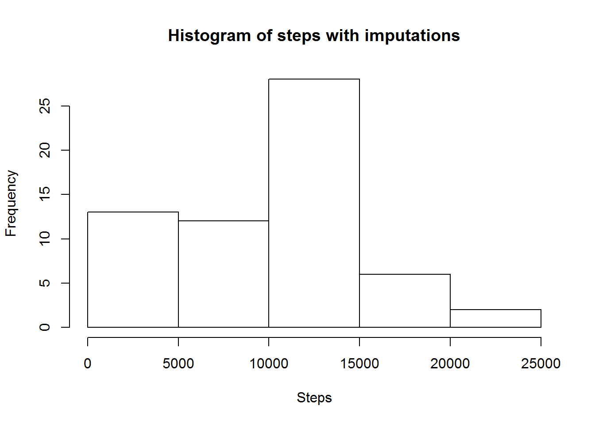

##1 Read in and prepare data


```r
setwd("C:\\Users\\Daniel\\Documents\\Coursera\\week2_reprod")
library(lubridate)
library(data.table)
par(mfrow = c(1,1))
D1<-read.csv("activity.csv")
D1$date<-as.Date(D1$date)
D2<-D1[order(D1$date),]
```

#2 Histogram of the total number of steps by day

```r
D3<-aggregate(steps~date,D2,sum) # Total number of steps taken per day
hist(D3$steps, main="Histogram",xlab = "Steps")
```


#3 Mean and median number of steps taken each day

```r
mean1<-mean(D3$steps,na.rm = TRUE)
median1<-median(D3$steps,na.rm = TRUE)
```
The mean number of steps by day is 1.076619\times 10^{4} and median is 10765

#4 Time series plot of the average number of steps taken

```r
mean2<-aggregate(steps~interval,D2,mean)
plot(mean2$steps~mean2$interval,main="Steps over time",ylab="Number of  steps",xlab="Interval",type="l")
```


#5 The 5-minute interval that, on average, contains the maximum number of steps

```r
D3<-aggregate(steps~interval,D2,mean)
D4<-D3[max(D3$steps)==D3$steps,]
```
The 5-minute interval that, on average, contains the maximum number of steps is interval number 835 with 206.17 (rounded to two decimals)steps. The average daily activity pattern is dominated by the pronounced peak at this interval.

#6 Code to describe and show a strategy for imputing missing data
Imputation will be performed by computing the median of all non-missing number of steps at each interval and inputing those values into corresponing ingervals with missing values.

```r
totMissings<-sum(is.na(D2$steps)) #The total number of missing steps.
median3<-aggregate(steps~interval,D2,median)
setnames(median3, "steps", "median")
Dmerge<-merge(D2,median3,by.x="interval",by.y="interval")
Dmerge<-transform(Dmerge, stepsImputed=ifelse(is.na(steps),median,steps))
Dmerge<-Dmerge[order(Dmerge$date),] #The data set with imputed values.
DmergeA<-aggregate(stepsImputed~date,Dmerge,sum) # Total number of steps taken per day
meanImputed<-mean(DmergeA$stepsImputed)
medianImputed<-median(DmergeA$stepsImputed)
```
The total number of missing values is 2304. 
The mean and median number of steps by day computed on the imputed dataset is meand=9503.87 and median=10395. This differ slightly form the non-imputed mean and median, but not to an unexpected degree.

#7 Histogram of the total number of steps taken each day after missing values are imputed

```r
median3<-aggregate(steps~interval,D2,median)
setnames(median3, "steps", "median")
Dmerge<-merge(D2,median3,by.x="interval",by.y="interval")
Dmerge<-transform(Dmerge, stepsImputed=ifelse(is.na(steps),median,steps))
Dmerge<-Dmerge[order(Dmerge$date),]
D3<-aggregate(stepsImputed~date,Dmerge,sum)
hist(D3$steps,main="Histogram of steps with imputations",xlab="Steps")
```



THe histogram over imputed values is less symmetric than the original histogram and skewed to the right.

#8 Panel plot comparing the average number of steps taken per 5-minute interval across weekdays and weekends

```r
#Dmerge is the imputed dataset.
Dmerge$wdayFactor <- ifelse(wday(Dmerge$date) %in% 1:5,1,ifelse(wday(Dmerge$date) %in% 6:7,2,-1))
unique(Dmerge$wdayFactor)#Checking that wdayFactor is only 1 or 2.
```

```
## [1] 1 2
```

```r
Dmerge$wdayFactor <- factor(Dmerge$wdayFactor,labels=c("weekday","weekend"))
mean4<-aggregate(stepsImputed~interval+wdayFactor,Dmerge,mean)
par(mfrow = c(1,2))
x<-mean4[mean4$wdayFactor=='weekday',]$stepsImputed
plot(x~mean2$interval,main="Steps on Weekdays",ylab="Number of steps",xlab="Interval",type="l",ylim=c(0,300))
y<-mean4[mean4$wdayFactor=='weekend',]$stepsImputed
plot(y~mean2$interval,main="Steps on Weekends",ylab="Number of steps",xlab="Interval",type="l",ylim=c(0,300))
```


There is an appearent difference between weekdays and weekends, where the activity pattern is smoother during weekdays, and the activity during weekends has a more pronounced max peak.
